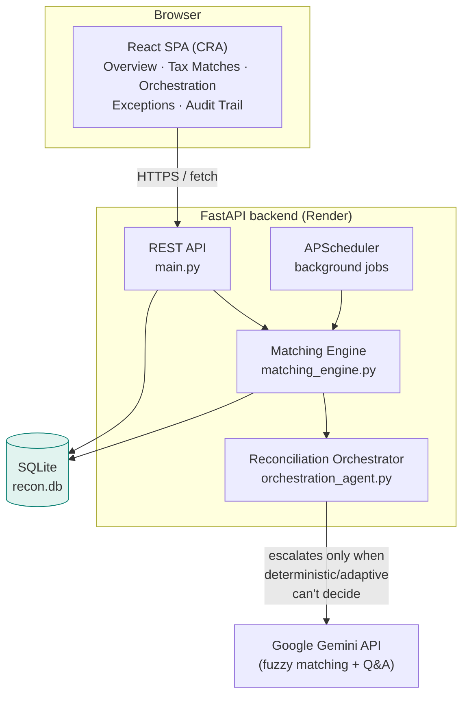

# recon.ai — AI-Orchestrated Reconciliation Agent

An autonomous finance reconciliation platform that matches bank transactions,
payment-gateway settlements, and ledger invoices — falling back to Gemini-powered
fuzzy matching only when deterministic rules can't decide, and explaining every
decision it makes.

## Why it exists

Finance teams reconcile bank statements against settlement reports and the
ledger by hand every close cycle — matching amounts, chasing fee deductions,
and writing up exceptions. recon.ai automates that pipeline end-to-end: import
your data, click reconcile, and get matched transactions, flagged exceptions,
tax-invoice matching, a cash forecast, and a full audit trail — with an AI
assistant that can answer questions about the results in plain English.

## Key features

- **Multi-tier matching engine** — deterministic exact-match first, adaptive
  pattern matching second, Gemini-powered fuzzy matching only as a last
  resort, so most of the pipeline runs with zero AI cost.
- **Tax invoice matching** — reconciles GST/VAT/TDS records against ledger
  invoices independently of the bank/settlement/ledger three-way match.
- **Orchestration insights** — a live dashboard of which strategy handled
  each decision, model usage split (Gemini vs local), and estimated tokens/
  cost saved by not calling the LLM for easy cases.
- **Self-learning exceptions** — patterns from human-resolved exceptions
  (e.g. recurring fee deductions) are remembered and auto-suggested next time.
- **Cash forecast** — projects balance from current cash + expected
  settlements − upcoming expenses, defaulting to live DB sums when you don't
  override them manually.
- **Receipt inbox** — upload a receipt/expense image or PDF; it's parsed and
  folded into the exception/expense picture.
- **Bring-your-own-data import** — upload your own bank/settlement/ledger/tax
  CSVs directly from the UI and reconcile against them immediately, instead
  of the seeded demo dataset.
- **AI Q&A assistant** — ask questions about the reconciliation state
  ("why was TXN10009 an exception?", "total unresolved amount?") and get
  answers grounded in the actual database, not a generic LLM guess.
- **Full audit trail** — every match attempt, success, and exception is
  logged with the reasoning and confidence behind it.

## Architecture



### Reconciliation pipeline (`POST /reconcile`)

Each stage only receives what the previous stage couldn't resolve — this is
what keeps LLM usage (and cost) low:

1. **Tier 1 — Deterministic exact match**: bank ↔ settlement ↔ ledger rows
   where amounts match within ₹0.01 and dates fall within a 3-day window.
2. **Tier 1 — Split/batch match**: handles many-to-one settlements (e.g. one
   bank credit covering several orders).
3. **Tier 2 — Adaptive / LLM fuzzy match**: pattern-based rules first (fee
   deductions, settlement delays); Gemini is only called for genuinely
   ambiguous leftovers.
4. **Tax match**: independently links `tax_txns` to `ledger_txns` by
   invoice ID and validates `base_amount × rate = tax_amount`.
5. **Exception flagging**: anything still unmatched is written to
   `exceptions` with a reason (`amount_mismatch_unexplained`,
   `missing_counterpart`, `duplicate`, …) for human review.

Every decision — matched or not — is written to `audit_log` with the
strategy, model, confidence, and a human-readable reason.

### Orchestrator decision logic

`orchestration_agent.py` picks a strategy per transaction pair, escalating
only when needed:

| Strategy | Trigger | Model |
|---|---|---|
| `deterministic` | Exact amount + date match | local (no AI) |
| `adaptive` | Learned patterns (fee deductions, delays) | local (no AI) |
| `llm_fuzzy` | Deterministic/adaptive both uncertain | Gemini |
| `hybrid` | Combines multiple weak signals | Gemini + local scoring |
| `tax` | Tax-invoice matching | local (no AI) |

## Tech stack

| Layer | Technology |
|---|---|
| Frontend | React 19 (Create React App), Recharts |
| Backend | FastAPI, Uvicorn |
| Database | SQLite |
| AI | Google Gemini (`google-genai`) |
| Scheduling | APScheduler |
| Memory (patterns) | mem0ai |
| Frontend hosting | Vercel |
| Backend hosting | Render |

## Project structure

```
recon-agent/
├── backend/
│   ├── main.py               # FastAPI app — all REST endpoints
│   ├── matching_engine.py    # Tier 1/2 matching, tax match, exceptions
│   ├── orchestration_agent.py# Strategy selection + decision logic
│   ├── schema.sql            # SQLite schema
│   ├── load_data.py          # Seed DB from bank/settlement/ledger/tax CSVs
│   └── requirements.txt
├── frontend/
│   └── src/
│       ├── App.jsx           # Main layout, tabs, state, refresh logic
│       ├── api.js            # Backend API client
│       └── components/       # SummaryCards, MatchesTable, TaxMatches,
│                              # OrchestrationInsights, CashForecast,
│                              # DataImport, ReceiptUpload, ChatbotQA, …
└── vercel.json                # Frontend build/deploy config
```

## API reference (selected)

| Endpoint | Purpose |
|---|---|
| `POST /reconcile` | Run the full matching pipeline |
| `POST /import/{source}` | Replace bank/settlement/ledger/tax data from an uploaded CSV |
| `GET /matches` | List all matched records |
| `GET /exceptions` | List open/resolved exceptions |
| `POST /exceptions/{id}/resolve` | Resolve an exception with a reason |
| `GET /tax-matches`, `GET /tax-summary` | Tax matching results |
| `GET /orchestration/strategy-stats`, `/orchestration/model-usage` | Orchestration dashboard data |
| `GET /stats/trend` | Real matched/exception counts, last 7 days |
| `GET /stats/summary`, `/stats/time-saved` | Overview KPIs |
| `POST /stats/cash-forecast` | Projected balance (live DB sums or manual override) |
| `POST /receipts/upload`, `/receipts/process` | Receipt ingestion |
| `POST /qa`, `POST /qa/stream` | Natural-language Q&A over the reconciliation data |
| `GET /audit-log` | Full decision trail |

Full interactive docs are available at `/docs` on the running backend.

## Data import format

`POST /import/{source}` (`source` = `bank` | `settlement` | `ledger` | `tax`)
accepts a CSV with these exact headers:

| Source | Required columns |
|---|---|
| `bank` | `ref_id, txn_date, amount, description` |
| `settlement` | `order_id, settle_date, amount, gross_amount, fee` |
| `ledger` | `invoice_id, invoice_date, amount, customer_name` |
| `tax` | `tax_id, invoice_id, tax_date, tax_type, tax_rate, base_amount, tax_amount, description` |

Each import **replaces** the corresponding table; run `/reconcile` afterward
(the UI's "Import & Run Reconciliation" button does both in one step).

## Local development

**Backend**
```bash
cd backend
python -m venv .venv && source .venv/bin/activate   # Windows: .venv\Scripts\activate
pip install -r requirements.txt
cp .env.example .env   # add your GOOGLE_GENERATIVE_AI_API_KEY
python load_data.py    # seeds recon.db from the sample CSVs
uvicorn main:app --reload
```

**Frontend**
```bash
cd frontend
npm install
echo "REACT_APP_API_URL=http://localhost:8000" > .env
npm start
```

## Deployment

- **Backend** → Render, root directory `backend`, start command
  `uvicorn main:app --host 0.0.0.0 --port $PORT`. Set
  `GOOGLE_GENERATIVE_AI_API_KEY` in Render's environment settings.
- **Frontend** → Vercel, build command `npm run build --prefix frontend`,
  output directory `frontend/build`. Set `REACT_APP_API_URL` to the Render
  backend URL and redeploy after changing it (it's baked in at build time).

Both platforms deploy on push to `main` if auto-deploy is enabled — check
each dashboard's Deploys tab if a change doesn't show up live.
